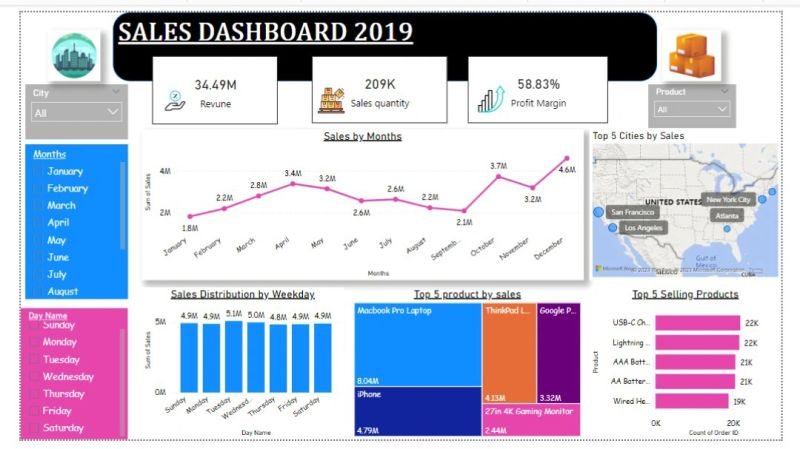

<!-- README.md for Chukwudi Peter Kubiat Jones -->

## 👋 ABOUT ME

Results-driven **Business Administration graduate** with strong expertise in **data analysis**, **international admissions**, and **digital marketing**. I have a proven track record in helping students secure **admissions and scholarships abroad** through strategic outreach, personalized coaching, and institutional partnerships.

Proficient in **Excel**, **Power BI**, **SQL**, and **Python**, with hands-on experience delivering **actionable insights** and managing **dashboards** for financial and operational performance.

Certified by **Google**, **Coursera**, **Zarttalent Academy**, and **Start Innovation Hub**, I possess a solid foundation in **digital marketing**, **HR operations**, and **business intelligence**.

I am passionate about using **data and technology** to drive decision-making, optimize processes, and support both **educational** and **business growth**.

---
## 🛠️ TECHNICAL EXPERTISE

**Programming Languages**  
`Python` • `DAX` • `M` (Power Query)

**Database Management & Querying**  
`MySQL` • `SQL` • `Relational Databases` • `ETL (Extract, Transform, Load)`

**Data Visualization & Reporting**  
`Power BI` • `Microsoft Excel (PivotTables, Charts, Dashboards)` • `Tableau`

**Spreadsheet & Office Tools**  
`Microsoft Excel` • `Google Sheets` • `Microsoft Word` • `Microsoft PowerPoint`

**Data Modeling & Analytics**  
`Power BI` • `Excel` • `KPI Development` • `Performance Dashboards`

**Data Manipulation & Analysis**  
`Python (Pandas, NumPy)` • `Excel (Formulas, Functions, Conditional Formatting)` • `Power Query`

**Data Cleaning & Transformation**  
`Excel` • `Python` • `Power BI` • `SQL`

**Version Control & Productivity**  
`GitHub` • `Google Workspace` • `Notion` • `Slack` • `Zoom`

**Other Tools & Platforms**  
`Google Analytics` • `Google Data Studio` • `Meta Ads` • `LinkedIn Campaign Manager`

---

## 💼 BUSINESS & MARKETING SKILLS

- International Admissions & Student Placement  
- Sales Strategy & Lead Generation  
- Digital Marketing (Google Certified)  
- Client Relationship Management  
- CRM & Outreach Campaigns  
- Business Development  
- Educational Consulting

---

## 💡 SOFT SKILLS

- Strategic Thinking & Problem Solving  
- Cross-functional Collaboration  
- Communication & Presentation Skills  
- Attention to Detail  
- Leadership & Teamwork  
- Adaptability & Continuous Learning  
- Time Management  
- Mentoring & Coaching

---

## 💼 WORK EXPERIENCE

- 🧠 **Business Analyst** at *Weatherford International*  
- 📊 **Data Analyst** at *Aptech Computer Education*  
- 💡 Former Intern at *Start Innovation Hub*  
- 🔍 Former Junior Analyst at *Turner Construction Ltd*  
- 🌍 Former Business Developer at *Landmark Career Ltd*

---

## 📂 PROJECT HIGHLIGHTS

### 📊 Power BI Sales Dashboard  
- Created an interactive dashboard showcasing **$34.49 in revenue**, **209K sales**, and **58.83% profit margin**.
  

### 🚗 Excel-Driven Car Sales Project  
- Analyzed car sales by **model, region, and age group**.  
- Built dimension tables, KPIs, and dashboards to aid business decisions.
   

---

## 🎓 EDUCATION

**BSc Business Administration**  
Arthur Jarvis University — *Graduated 2021*

---

## 📜 CERTIFICATIONS

- 🎓 **Google Digital Skills for Africa** — Fundamentals of Digital Marketing  
- 📊 **Start Innovation Hub** — Data Analysis Training  
- 📈 **Zarttalent Academy** — Data Analysis Certificate  
- 🧮 **Coursera** — Google Data Analytics (In Progress or Completed)

---

## 🤝 LET’S CONNECT

- 📧 Email: [chuksjones773@gmail.com](mailto:chuksjones773@gmail.com)  
- 📍 Uyo, Akwa Ibom State, Nigeria  
- 📞 Phone: [+234 808 871 7569](tel:+2348088717569)  
- 📄 [Download My CV](https://drive.google.com/file/d/1nyF_yJDyD51-e-9RPizIF3-kGNB0pwDK/view?usp=drive_link)  
- 🌐 [LinkedIn](https://www.linkedin.com/in/chukwudi-jones-99152228a?utm_source=share&utm_campaign=share_via&utm_con)  
- 🐦 [X (Twitter)](https://x.com/Chuks_Jonesss?t=z6N7eGt1EIGhbUMMEMscAA&s=09)  
- 📘 [Facebook](https://www.facebook.com/share/1Bhi8Qo2b6/)

---

_Thanks for visiting my portfolio! Let's build and analyze something amazing together. 🚀_
